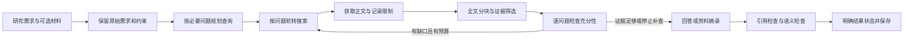

# AgentScout

单用户研究助手：把研究需求拆成必要问题，检索资料、提取证据、检查问题覆盖，再生成可追溯的回答。岗位描述可以作为研究材料，但不再触发单独的“求职”流程。Python 3.11+；模型推理使用云端 API，Mock 演示无需密钥。

## 当前流程



节点为 prepare_research → plan_research → search_sources → fetch_pages → assess_evidence → synthesize_report → validate_citations → finalize。补查最多执行配置的轮数，报告最多修复一次；节点快照与最终轨迹存入 SQLite。可选 Judge 是独立评审，不修改原研究的费用、状态或轨迹。

关键约束和改动细节见 [研究逻辑说明](docs/research-logic.md)。

## 安装与运行

在仓库根目录执行，保留 data/mock_sources.json 与 evals/dataset.json：

```powershell
py -3.11 -m venv .venv
.\.venv\Scripts\python.exe -m pip install -r requirements.txt
.\.venv\Scripts\python.exe -m streamlit run app.py --server.address 127.0.0.1 --browser.gatherUsageStats false
```

已有 Python 3.12+ 时可用该版本创建虚拟环境。Linux/macOS 使用 python3、.venv/bin/python 代替 Windows 路径。

界面提供 Research、Trace、Evaluation。输入研究目标、排除项、时间范围和输出要求；需要分析已有文本时，填入“提供的研究材料”。只用材料时明确写“仅根据提供的材料，不要联网”。材料与指令分开保存，不把用户需求本身当作证据。

```powershell
# 不联网、不调用模型的演示
.\.venv\Scripts\python.exe -m agent "比较 LangGraph 和 CrewAI 的适用场景"
# 真实检索与模型
.\.venv\Scripts\python.exe -m agent "研究制造业技能要求变化的原因，不需要求职建议" --real --output data/report.md
# UTF-8 文本材料；需要在研究需求中声明是否允许外部检索
.\.venv\Scripts\python.exe -m agent "仅根据提供的材料总结，不要联网" --material data/material.txt --real
# 绕过网页缓存
.\.venv\Scripts\python.exe -m agent "研究当前的相关证据" --real --refresh
```

CLI 退出码：0 为研究完成或明确标注的演示；1 为执行失败；2 为部分结果、证据不足或需要复核。即使未完成研究，只要产生报告也会保存。

## 配置与预算

复制 .env.example 为根目录 .env，并填写本机配置。LLM_API_KEY、LLM_BASE_URL、LLM_MODEL、TAVILY_API_KEY 用于真实模式。SEARCH_PROVIDER 只决定界面的默认 Mock 开关；CLI 用 --real 明确选择真实模式。密钥只读取本地 .env，不回退到同名系统环境变量。模型名可在界面或 CLI 覆盖。

预算集中在 config.py；所有字段支持大写同名 .env 配置，Pydantic 校验范围。

| 配置 | 默认值 | 含义 |
|---|---:|---|
| MAX_QUESTIONS | 8 | 必要子问题上限，允许只有一个问题 |
| MAX_SEARCH_CALLS / MAX_CANDIDATES | 12 / 30 | 搜索尝试总数 / 候选池上限 |
| MAX_FETCH_PAGES / MAX_ROUNDS | 8 / 2 | 获取页面数 / 检索评估轮数 |
| MAX_LLM_CALLS | 10 | 包括重试、审查、修复的研究模型调用上限 |
| MAX_TOTAL_TOKENS | 100000 | 调用前估算的整次研究 Token 上限 |
| MAX_COST_USD | 0 | 模型估算费用上限；0 关闭该上限 |
| RESEARCH_TIMEOUT_SECONDS | 180 | 协作式研究时间预算，超时停止新工作 |
| LLM_TIMEOUT_SECONDS | 30 | 单次模型网络操作超时 |
| MAX_DOWNLOAD_BYTES | 2000000 | 单页解码后响应字节预算，达到上限会明确标注不完整 |
| CACHE_TTL_SECONDS | 600 | 页面缓存有效期；0 禁用读取和写入 |
| CONTEXT_TOKEN_BUDGET / EVIDENCE_TOKEN_BUDGET | 16000 / 6500 | 单次上下文 / 证据选材 Token 预算 |
| PLAN_MAX_TOKENS / REPORT_MAX_TOKENS / REVIEW_MAX_TOKENS | 1800 / 4000 / 2400 | 各阶段输出 Token 上限 |

PRICE_PER_MILLION_TOKENS 为供应商输入/输出混合单价，需自行填写；0 表示未配置价格，不代表免费。设置金额上限却未配置价格时拒绝模型调用。预算是近似估算，不是供应商精确账单；搜索供应商费用另计。无 usage 的失败请求会保留预算占用并标记费用未知，不把未知收费当零。独立 Judge 使用相同配置限制自身的一次评审，费用另列，不占用已结束的研究记录。

HTTP 超时按网络操作计算，总时间预算无法强制打断所有 DNS/底层阻塞。原始需求过长时明确降级，不静默删掉后半段约束。

## 证据与完成状态

- 不再保留“前 8000 字符”或“前 1000 字符”作为固定选材规则。扫描已获取的所有清洗段落、表格行与长段落尾部，按问题相关性及来源多样性选择上下文。
- 网络下载和模型上下文仍有预算。下载不完整、只获取到摘要、未入选片段数量均可查；不会宣称已完整阅读页面。HTTP 200 的验证/拦截页不能直接作为成功正文。
- 每条证据保存来源、证据 ID、类型、原文位置、获取时间和可获得的发布日期。搜索摘要、网页正文、用户材料、Mock 教学摘要分别标记。
- 每个问题评为 supported、partial、missing 或 conflicting。针对缺口补查；发布日期或抓取日期本身不能证明内容适用于指定时间。
- 正文事实段落使用 [证据 E标识](URL)。先检查标识和 URL 是否对应选中片段，再检查回答是否遵守需求、有证据支持；最多修复一次，修复失败保留原报告。

| 状态 | 意义 |
|---|---|
| completed | 必要问题证据充分、引用通过且模型语义检查通过 |
| partial | 有资料，但问题覆盖、时效确认或模型回答尚未完成 |
| needs_review | 已有回答，引用或语义检查仍有问题 |
| insufficient_evidence | 没有可用的入选证据 |
| demo | 使用 Mock 教学资料，不能算真实研究完成 |
| failed | 关键节点或保存失败 |

execution_status=finished 仅表示流程运行完毕；success 只在 completed 时为真。completed 也不是对客观事实绝对正确的保证：充分性和语义检查仍由模型判断，关键结论应人工核对。

缺少模型配置、调用失败、响应被截断或预算不足时，可以保留真实检索资料并输出明确标注的摘录与未解答问题，不伪装成完成答案。没有匹配资料时不会填充无关 Mock 来源。

## 评测与验证

数据集有 20 条任务，包括通常研究、领域外查询、限定材料、缺失材料与时间范围。baseline 和 structured 使用相同取证预算，仅改变模型回答的表达要求。Mock 不调用模型，两种策略的摘录相同属于预期行为。

```powershell
.\.venv\Scripts\python.exe -m pytest -q
.\.venv\Scripts\python.exe -m evals.runner --variant baseline --limit 20 --output evals/results/mock-v2-baseline.json
.\.venv\Scripts\python.exe -m evals.runner --variant structured --limit 20 --output evals/results/mock-v2-structured.json
.\.venv\Scripts\python.exe -m evals.runner --real --limit 10 --model YOUR_MODEL --output evals/results/live-v2.json
```

指标分开解释：

- 流程执行率：执行到正常结束的比例，可包含证据不足。
- 研究完成率：只接受 completed，并重新检查报告、逐问题证据、引用与语义检查结果。
- 预期行为通过率：离线任务是否得到预设的 demo 或 insufficient_evidence 状态；仅检验这些行为。
- 段落引用率：需要证据的正文段落中有合法引用的比例；来源列表中的链接不能代替正文引用，也不证明论断成立。
- 来源利用率：被正文合法引用的来源占入选证据来源的比例，与段落引用率分开。
- 关键词召回：剔除需求回显、标题、来源列表后进行简单中英文别名匹配，仅作辅助诊断，不决定完成。
- 研究成本与 Judge 成本分列；有 usage 时记录供应商返回的值，否则标记估算或未知。

schema_version=2 的结果才进入当前 Evaluation 对比。旧版 mock-baseline.json、mock-structured.json、截图和录屏保留为历史材料，原有“100% 完成率”不能与新版口径比较。新样例见 [示例摘录](docs/sample-report.md)。

本次仅进行了离线测试和模拟网络/模型回包验证，没有调用真实付费 API；不据此声称实时检索质量、模型准确率或真实成本已验证。

## 存储、安全与范围

每次研究生成新 run ID；不缓存并重用整个研究结果。页面缓存最多 128 项、按 TTL 失效，命中保留原获取时间；显式刷新和时间范围任务绕过缓存。SQLite 保存节点快照和最终状态，Judge 独立存储，旧记录可读且标记 legacy；不自动恢复中断任务。

外部网页与报告作为不可信数据，不执行其中的命令。抓取拒绝私有地址并检查重定向，但不是防 DNS rebinding 的生产级沙箱。密钥脱敏；输入、用户材料、来源和报告在本机数据库中明文保存。界面默认绑定 127.0.0.1，无登录和多租户权限。

当前仍为同步、单用户 MVP：只支持 HTML 与纯文本正文，PDF/动态网页失败时明确保留摘要及原因；词法选材可能漏掉同义表达，模型也可能误判证据。语义检索、PDF 解析、真实供应商评测和人工标注是后续工作。

目录：agent 主流程；models 数据结构；tools 检索与抓取；storage 存储；observability 轨迹；evals 数据集与评审；tests 回归测试；docs 当前逻辑与历史演示；data 演示语料和本地数据库。
