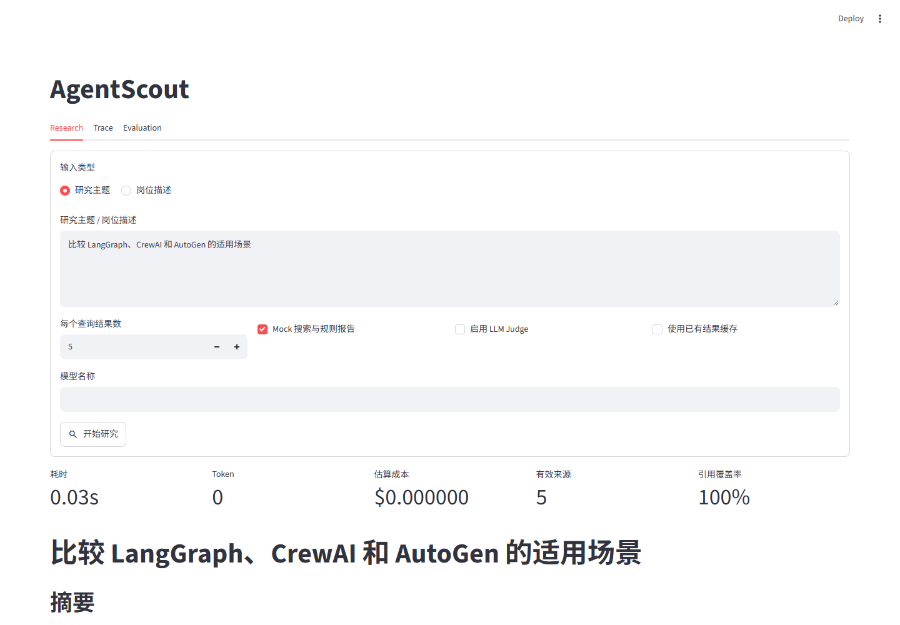
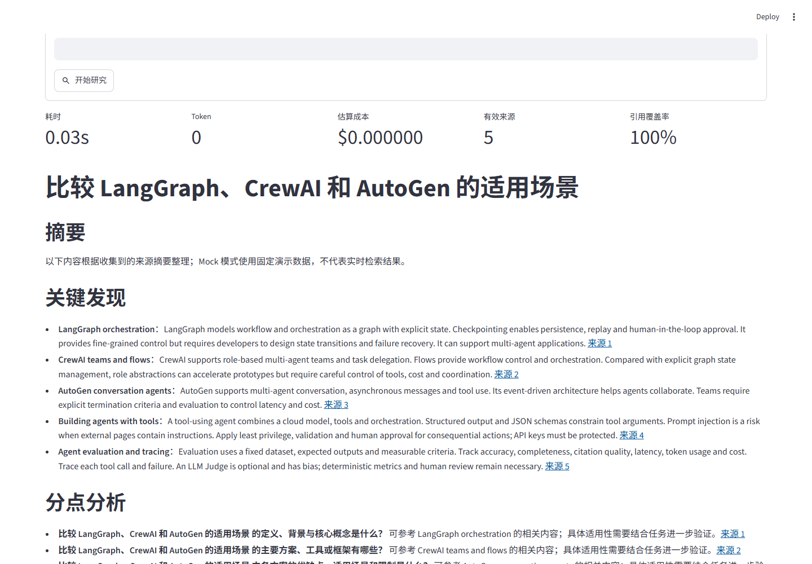
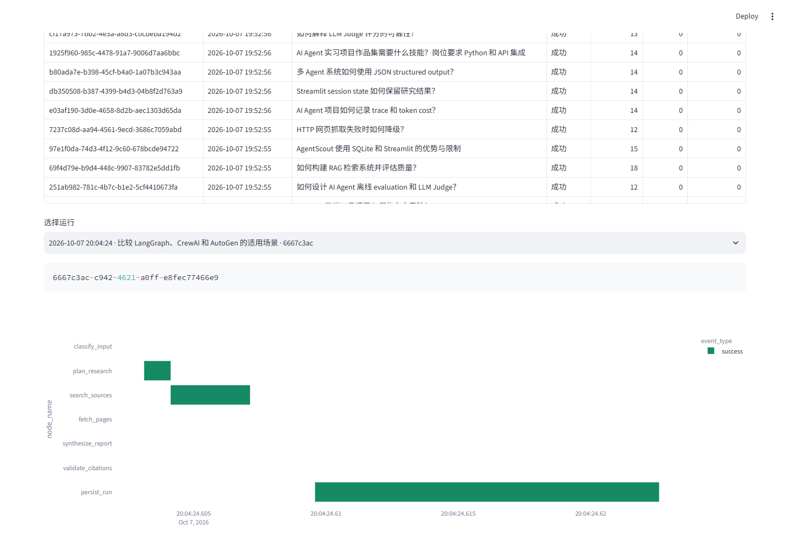
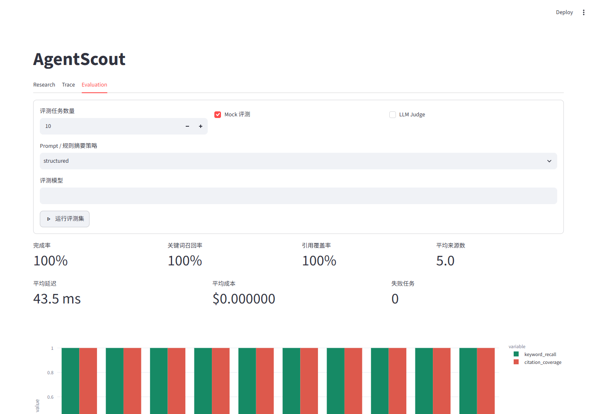
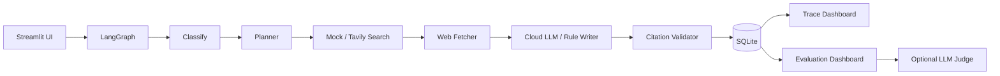

# AgentScout

轻量级研究 Agent MVP：输入研究主题或 AI 岗位描述，完成任务拆解、搜索、正文提取、带引用报告、SQLite 轨迹记录与离线评测。Python 3.11+、单用户、单进程；所有模型推理使用云端 API，不运行本地大模型。

## Demo









[演示录屏（WebM）](docs/demo.webm)。录屏展示 Mock 研究、Trace 时间线、批量评测和移动端布局。

## 架构



主图固定执行 `classify_input → plan_research → search_sources → fetch_pages → synthesize_report → validate_citations → persist_run`。引用最多修复一次；关键节点失败时保存已有状态和失败事件，页面允许重试。最终再次提交 SQLite 事务，包含 `persist_run` 自身的结束事件。Judge 为用户选择后的额外节点。

## 功能与技术栈

- 研究主题、岗位描述两种输入；规则分类与云端结构化分类。
- 3–5 个子问题及查询；模型失败时使用保持原任务信息的本地 planner。
- Tavily、固定 Mock 数据；每个查询数量统计、URL 去重、空结果与网络错误提示。
- 公开 HTTP(S) 正文清洗；抓取失败保留标题、URL、摘要和失败原因。
- Markdown 报告、下载、引用有效性、覆盖率、重复 URL 与明显无依据断言的启发式检查。
- SQLite 运行历史和完整 JSON 状态；各节点起止时间、耗时、状态、调用次数、Token、估算成本。
- 16 条离线评测数据；规则指标、可选 LLM Judge、不同模型/策略对比。
- Streamlit Research / Trace / Evaluation，Plotly 时间线和指标图表；同步执行期间禁用提交。

技术栈：Python、LangGraph、LangChain Core（LangGraph 依赖）、Pydantic、Streamlit、SQLite、httpx、BeautifulSoup4、python-dotenv、Plotly、pytest。无需 Redis、PostgreSQL、消息队列或登录。LangSmith 的 Python 包可能由 LangChain 间接安装，但没有 LangSmith 服务、账号或 Key 的运行要求。

## 安装与启动

在本仓库根目录执行以下命令，建议使用独立虚拟环境：

```powershell
py -3.11 -m venv .venv
.\.venv\Scripts\python.exe -m pip install -r requirements.txt
.\.venv\Scripts\python.exe -m streamlit run app.py --server.address 127.0.0.1 --browser.gatherUsageStats false
```

已有 Python 3.12+ 时，可以改用 `python -m venv .venv` 或 `py -3.12 -m venv .venv`。打开终端显示的地址，通常为 `http://localhost:8501`。不需要激活 PowerShell 虚拟环境，因此不受脚本执行策略影响。

Linux/macOS：

```bash
python3 -m venv .venv
.venv/bin/python -m pip install -r requirements.txt
.venv/bin/python -m streamlit run app.py --server.address 127.0.0.1 --browser.gatherUsageStats false
```

## 配置

Mock 模式不需要 `.env`。使用云端 API 时，在根目录创建 `.env`，配置格式参考 `.env.example`：

```dotenv
LLM_PROVIDER=openai_compatible
LLM_BASE_URL=https://api.openai.com/v1
LLM_API_KEY=
LLM_MODEL=
SEARCH_PROVIDER=tavily
TAVILY_API_KEY=
PRICE_PER_MILLION_TOKENS=0
LLM_TIMEOUT_SECONDS=30
```

把实际密钥只填写在本机 `.env`。页面没有密钥输入框，也不显示密钥；密钥仅由根目录 `.env` 读取，系统环境变量中的同名 Key 不会作为来源。兼容服务需支持 `/chat/completions`、`messages` 和文本回答，模型名称可通过页面或 CLI 覆盖。`PRICE_PER_MILLION_TOKENS` 是美元计价的输入/输出混合单价，需按供应商价格手动配置。0 表示尚未配置价格，并不表示云端调用免费。

## Mock 与真实 API

Mock：保留 Research 的 Mock 勾选后开始研究。Mock 使用 `data/mock_sources.json` 的教学摘要，不联网、不调用模型，报告明确标注数据性质。Mock 摘要由项目作者编写，官方 URL 是演示来源标识，不是对网页原文的逐字引用。搜索按简单词法匹配排序，再补足候选，因此不适合评估开放领域检索质量。

```powershell
.\.venv\Scripts\python.exe -m agent "比较 LangGraph、CrewAI 和 AutoGen 的适用场景"
```

真实 API：配置 `.env` 的 Tavily Key、LLM Key、模型和 base URL，取消 Mock 勾选。CLI 示例：

```powershell
.\.venv\Scripts\python.exe -m agent "比较 LangGraph 和 CrewAI" --real --output data/live-report.md
```

没有 Tavily Key 或所有查询失败时，本次运行返回清晰错误并写入 SQLite，可手动切换 Mock 重试；不会自动把演示数据混入实时报告。部分查询失败则保留已成功的来源并展示警告。缺少 LLM 配置或模型调用失败时，展示警告并使用规则规划/摘要，因此仍可测试真实搜索与抓取链路。

## 评测

默认执行前 10 条任务；可扩展至全部 16 条，代码上限 20 条。无 Judge API 时规则指标照常运行，Judge 会提示跳过。

```powershell
.\.venv\Scripts\python.exe -m pytest -q
.\.venv\Scripts\python.exe -m evals.runner --variant baseline --limit 16 --output evals/results/mock-baseline.json
.\.venv\Scripts\python.exe -m evals.runner --variant structured --limit 16 --output evals/results/mock-structured.json
.\.venv\Scripts\python.exe -m evals.runner --real --limit 10 --model YOUR_MODEL --output evals/results/live.json
# 可选：在上一条命令增加 --judge
```

Evaluation 读取保存的 JSON，或在页面运行评测。每次运行都持久化到 SQLite；同一会话内的模型和策略对比显示在表格中。JSON 可以提交到版本控制，SQLite 文件与 `.env` 已忽略。

指标定义：

- 关键词召回：大小写无关的字符串包含检测，命中期望关键词数 / 唯一期望关键词数。未匹配同义词，不等同于语义准确度。
- 引用覆盖率：报告按规范引用的有效唯一 URL 数 / 搜索阶段的全部候选唯一 URL 数，包含未抓取的候选来源。
- 来源数量：有效唯一引用 URL 数；正文与来源列表重复引用不会重复计数。
- 完成率：报告非空、关键词召回至少 0.5（任务可覆盖阈值）、有效来源达到任务最低要求、关键节点无错误。
- 延迟：运行的端到端耗时；评测包含规则计算和可选 Judge，不包含最后保存评测 JSON 的时间。
- Token：优先使用 API `usage.total_tokens`。没有 usage 时采用 `ceil((system + user + answer 的字符总数) / 2)` 的粗略中英文混合估算，记录 `usage_estimated`。Mock 没有模型调用，Token=0。
- 成本：`总 Token × 配置混合单价 / 1,000,000`，包含可选 Judge。失败请求未返回 usage 时无法得知真实计费；成本是近似值，不代替供应商账单。

## 实测结果

2026-10-07，本机 Python 3.12.14、LangGraph 1.2.14、Streamlit 1.65.0，16 条固定任务、每查询 5 个结果、无结果缓存、Judge 关闭，执行一次离线 Mock 评测：

| 策略 | 完成率 | 关键词召回 | 引用覆盖率 | 平均有效来源 | 平均延迟 | 平均模型成本 | 失败任务 |
|---|---:|---:|---:|---:|---:|---:|---:|
| baseline | 93.75% | 98.44% | 40% | 2 | 22 ms | $0 | 1 |
| structured | 100% | 98.44% | 100% | 5 | 21.13 ms | $0 | 0 |

原始逐条结果见 `evals/results/mock-baseline.json` 与 `evals/results/mock-structured.json`，含运行 ID、时间、任务失败原因。这里只证明离线流程与规则指标可用：Mock baseline 取前两份摘要，structured 取最多五份；没有真实云端 Prompt 优化、实时内容准确度或付费 Token 成本结论。查询数据和关键词同属演示领域，且报告标题含原始输入，关键词指标偏乐观。评测耗时会随机器、SQLite 历史和冷启动变化。

目前未提供真实 API 密钥，因此真实供应商端到端运行尚未验证。测试使用模拟 HTTP 回包验证真实模式适配器、usage 计数、自定义客户端接口和故障降级；配置密钥后可用上述 `--real` 命令取得真实实验结果。

## 失败案例与改进

1. `eval-002` 比较三个框架，需要至少 3 个有效来源。baseline 召回率 100%，但仅引用 2 个来源，完成判定失败。structured 扩展到五份来源后引用覆盖率与完成率达标，明确区分“关键词出现”与“任务完成”。
2. fallback planner 的一个通用比较查询曾不包含原始主题，相关性测试失败。修复为每条查询都包含主题；岗位描述查询还保留原始 JD 的技术要求片段。
3. 搜索无 Key、连接失败、空结果均保存失败轨迹；抓取超时保留摘要并记录原因。非法引用尝试一次修复后仍不合格时展示警告，避免无限循环。
4. 同一报告同时出现在多个 Tab 时曾造成 Streamlit 下载控件 Key 冲突，已加入视图作用域并由 UI 集成测试覆盖。

## 性能限制

- 单次最多 5 个网页，每页最多 8,000 个正文字符；HTML 临时下载上限 1 MB，不持久化完整 HTML。
- 搜索候选最多 10 条，计划最多 5 个问题。HTTP 抓取/搜索超时 10 秒，LLM 默认 30 秒；超时为 HTTP 客户端网络操作超时，并非完整研究的总耗时保证。
- 网页 URL 内存缓存最多 128 个条目；可选研究结果缓存最多 32 项，键包括输入、模式、模型、参数和 base URL。命中缓存复用已有 run ID，不创建新的执行轨迹。
- 单进程同步执行，不启动后台队列；SQLite 单文件写入，数据量随历史增长。多用户权限、并发写入调度和历史清理不属于本 MVP。
- 规则摘要以来源摘录为主，不能替代 LLM 的深入分析。URL 去重按精确字符串，不自动合并跟踪参数、不同协议或尾斜线。
- 引用校验是启发式规则：检查 Markdown 引用 URL、关键发现/分析的列表项引用、未受正文支持的百分比与明显绝对化断言，无法证明全文的事实正确或检索来源可靠；需要人工复核或 Judge。

## 安全

`.env`、数据库、虚拟环境均被 `.gitignore` 排除；代码、日志、页面没有真实密钥。错误消息按当前配置密钥脱敏，Pydantic 配置对象隐藏密钥字段。不要将密钥放在用户研究输入中。

网页抓取拒绝本地/私有网络地址，并逐跳检查重定向；这不是完整防 DNS rebinding 的生产级网络沙箱。外部正文可能包含 prompt injection，模型提示将正文视为不可信数据；Agent 不执行来源中的代码或指令。JD、输入、清洗正文与报告以明文保存在本机 SQLite，分享数据库或录屏前检查内容。默认绑定 `127.0.0.1`，无认证界面不宜暴露到公网。

## 目录

`agent/` 主流程与 LLM；`models/` 数据结构；`tools/` 检索和正文提取；`storage/` SQLite；`observability/` 节点事件；`evals/` 数据集、Judge、指标、逐条运行详情和评测结果；`tests/` 单元和 UI 集成测试；`docs/` 截图与演示视频；`data/` Mock 数据和忽略的本地数据库。

## 后续规划

配置实际供应商 API 后补充真实检索/模型对比、多次重复实验和人工质量标注；细分输入与输出 Token 单价；增强语义关键词召回、事实支持度评估与有限重试；增加 SQLite 历史清理和可选 LangSmith 导出。
